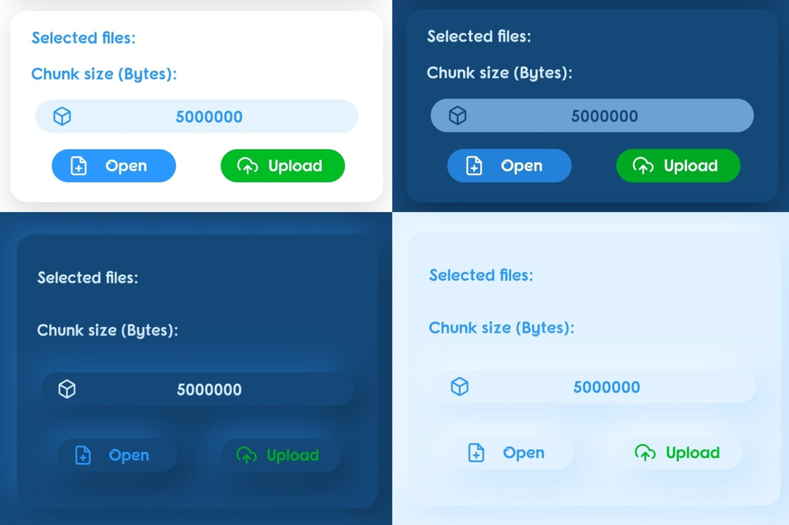

# **Phoerest Share**

A simple local wireless file sharing app using Node.js

## **Tested on:**

Android: 10.

npm: v6.14.8.

# **Getting started**

## **On the server:**

1. Open the terminal.
1. Navigate to the folder where you want to receive and send files.
1. Install npm then install the script by running `npm i phoerest-share -g`
1. Run the script by typing `phoerest-share`
1. Optional:
	1. Type `port [port-number]` to change the port number. The default port number is 3000.
	1. Type `pass [password]` to change the password. The default password is 1234.
	1. Type `theme [number 0-3]` to change the theme. Theme 0 & 2 are light mode. Theme 1 & 3 are dark mode.
	1. Type `save` to save the current argumants permanently.
	1. ex: `phoerest-share port 8080 pass 4321 theme 3 save`
1. Move the files you want to share with clients to the "shared" folder.
1. The files sent to the server will be in the "received" folder.
1. Make sure to delete the "tmp" folder if it gets big after failed sharing attempts.
1. If the user downloads a file and received only text, compress the shared file in a zip file and move it to the "shared" folder.
1. If you mess something up, delete the package by typing `npm uninstall phoerest-share` and repeat the steps above.

A text should print in the terminal with your local IP address. Share the "Visit" link with others to share files with them.

**Notes:**

If you got a "0.0.0.0" IP, make shure you are connected to a network.

You can turn your server device into a hotspot in your device settings and make the clients connect to it if no router is available. In this case the client should enter the default gateway of his device in URL bar. The default gateway can be found in the connection section in the device settings.

## **On the client:**

1. Paste the server IP address (the "Visit" link from previous section) in the URL bar of your internet browser and hit enter.
1. Enter the password in the password field. The default password is 1234.
1. Click on "Open" to select the files to share.
1. Click on "Upload" to upload the selected files to the server.
1. Click on "Get" to get the server shared files.

# **Features:**

1. Share files on a local network without internet connection.
1. Share huge files that is only limited by your device storage.
1. Nice UI :)

# **License:**

This project is licensed under the MIT License. See the LICENSE file.
